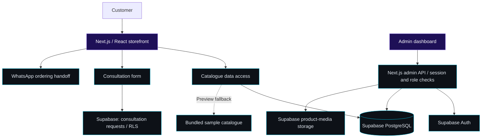
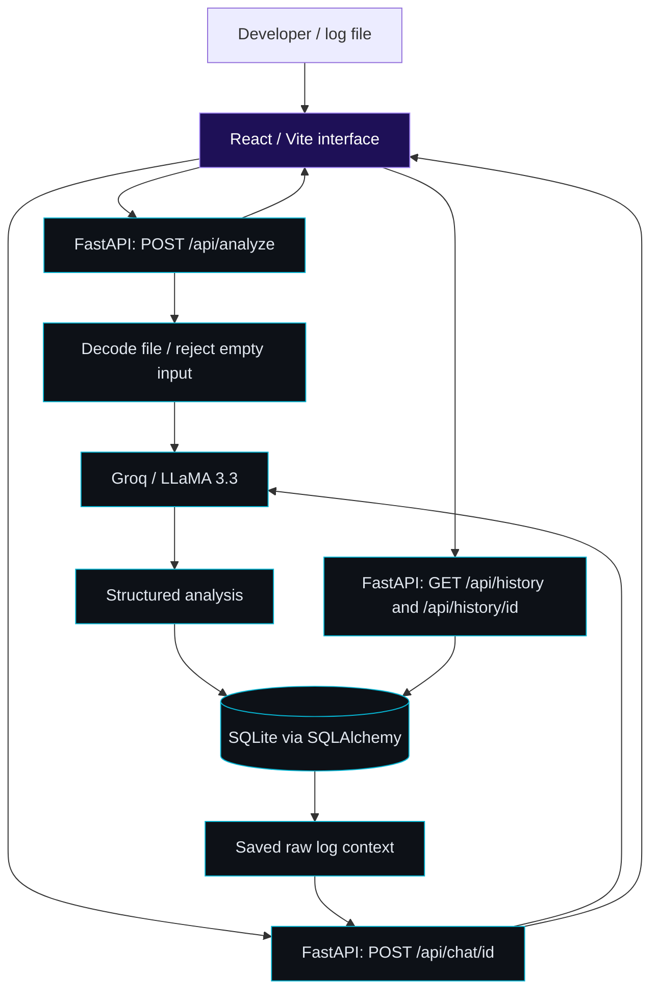

<!-- ══════════════════════════════════════════════════════════════ -->
<!--                     ANIMATED HEADER BANNER                    -->
<!-- ══════════════════════════════════════════════════════════════ -->

 

<!-- ANIMATED TYPING SVG -->

 

<!-- STATUS BADGES -->

  
  &nbsp;
  
  &nbsp;
  

<!-- SOCIAL LINKS -->

  
  &nbsp;
  
  &nbsp;
  
  &nbsp;
  
  &nbsp;
  

 

---

## 🧑‍💻 About Me

I'm a **software and AI engineer** building full-stack products that people can actually use — AI tutoring platforms, career coaching tools, gadget commerce stores, pet-care discovery services, and polished company websites.

My work spans **React / Next.js**, **Python / FastAPI**, **Supabase**, and **LLM integrations**. I cover every layer: responsive UI, backend architecture, authentication, external API pipelines, and automated AI workflows. I care about **practical utility**, **clear interfaces**, and **systems that hold up at scale**.

Based in **Abuja, Nigeria** — and founder of **NEXUSTEM**, connecting Africa's next generation with AI, coding, robotics, and hands-on STEM learning.

<strong>🎯 What I bring to a team</strong>

 

| Capability                            | Examples in Practice                                                                    |
| :------------------------------------ | :-------------------------------------------------------------------------------------- |
| 🏗️ **End-to-end product engineering** | Storefronts, dashboards, vendor workflows, admin systems, and database integration      |
| 🧠 **Applied AI & LLM integration**   | Tutoring agents, CV feedback, log diagnostics, market insights, conversational UX       |
| 🎨 **Interface craft**                | Responsive design systems, motion, theme switching, and accessible interaction patterns |
| 🔌 **API & data pipelines**           | Supabase, Groq, discovery feeds, contact flows, external APIs, and webhooks             |
| ✅ **Quality engineering**            | Playwright tests, TypeScript checks, ESLint, Zod validation, and Git workflows          |

 

### 📋 Project Directory

| Project                  | What It Does                                                 |                                                     Links                                                      |
| :----------------------- | :----------------------------------------------------------- | :------------------------------------------------------------------------------------------------------------: |
| 🛒 **Dercy Tech**        | Gadget discovery, expert consultation, and WhatsApp ordering |          [🌐 Live](https://dercy-tech.vercel.app/) · [📂 Code](https://github.com/IFVERSE/dercy-tech)          |
| 🐾 **PetSquare**         | Pet-care discovery and deals for European markets            |        [🌐 Live](https://petsquare-mu.vercel.app/en) · [📂 Code](https://github.com/IFVERSE/petsquare)         |
| ✨ **IRIS Tech & Media** | Company website, motion, themes, and inquiry flows           |                                    [🌐 Live](https://iristechandmedia.com/)                                    |
| 🧠 **KidGenius AI**      | AI tutoring for children ages 7–16                           |    [📂 Code](https://github.com/IFVERSE/kidgenius-ai) · [🎬 Demo](https://youtube.com/watch?v=O1fbhOQ9VF8)     |
| 🧭 **AI Career Coach**   | Career tools designed for African professionals              | [📂 Code](https://github.com/IFVERSE/ai-career-coach) · [🎬 Demo](https://www.youtube.com/watch?v=uHeGzcgr7Hg) |
| 🔎 **AI Log Analyzer**   | Log uploads, structured AI analysis, follow-up chat          | [📂 Code](https://github.com/IFVERSE/ai-log-analyzer) · [🎬 Demo](https://www.youtube.com/watch?v=PntYGfICz-g) |
| 📊 **Nexus Trade AI**    | Crypto market research, journaling, and AI insights          |   [📂 Code](https://github.com/IFVERSE/nexus-trade-ai) · [🎬 Demo](https://youtube.com/watch?v=k5pmdMPSE_g)    |
| 🌱 **NEXUSTEM**          | Africa's STEM initiative and beta community                  |                 [📧 Join](mailto:nicholasayuk1@gmail.com?subject=NEXUSTEM%20Beta%20Community)                  |

---

## 📊 GitHub Stats

&nbsp;

  

  

<!-- TROPHIES -->

 

<!-- ACTIVITY GRAPH -->

---

## 🏗️ Selected Work

> Three live productions — commerce, discovery, and digital brand.

 

<!-- ═══ DERCY TECH ═══════════════════════════════════════════════ -->

<table width="100%">
<tr><td>

### 🛒 Dercy Tech — Gadget Commerce & Consultation

  

  

A gadget storefront unifying product discovery, expert consultation, and WhatsApp ordering into one seamless experience.

- 🔍 **Discover** — searchable catalog, category browsing, full specifications, and related product suggestions
- 🤔 **Decide** — consultation requests matched to customer purpose, budget, and gadget needs
- 💬 **Connect** — pre-filled WhatsApp ordering with direct sales conversation handoff
- 📱 **Experience** — fully responsive layouts built around the Dercy Tech visual brand

</td></tr>
</table>

 

<!-- ═══ PETSQUARE ════════════════════════════════════════════════ -->

<table width="100%">
<tr><td>

### 🐾 PetSquare — Pet Discovery & Deals Platform

  

  

A European pet-care discovery and deals marketplace connecting owners with AI-matched products, vendors, and personalized recommendations.

- 🐶 **Pet owners** — pet profiles, personalized picks, saved items, deals, and price-target tracking
- 🏪 **Vendors** — business onboarding, deal management, inbox, and analytics dashboard
- ⚙️ **Operations** — role-based admin, moderation tools, and audit logs
- 🤖 **AI & Discovery** — Groq-powered assistance, OpenStreetMap discovery, and Apify-cached product data

</td></tr>
</table>

 

<!-- ═══ IRIS ══════════════════════════════════════════════════════ -->

<table width="100%">
<tr><td>

### ✨ IRIS Tech & Media — Brand & Digital Experience

  

  

A polished company website presenting digital product design, software engineering, and media production through a responsive, animated experience.

- 🎨 **Brand storytelling** — service sections, delivery process, company info, and portfolio presentations
- ✨ **Visual detail** — layered product previews, scroll reveals, and coordinated hero transitions
- 🌗 **Themes** — day, night, and device themes with mobile navigation and reduced-motion support
- 📨 **Inquiry flow** — validated contact submissions routed through a Next.js server endpoint

</td></tr>
</table>

---

## 🤖 AI Projects

<table>
<tr>
<td width="50%" valign="top">

### 🧠 KidGenius AI

  

 

**Make learning feel like discovery.**

AI tutoring for children 7–16 with 4 tutor personalities, voice interaction, visual explanations, personalized quizzes, and educational stories.

**Highlights:** STEM coding challenges · XP progression · parent dashboard · speech accent options

`React` · `FastAPI` · `Groq` · `LLaMA 3.3` · `SQLite` · `Web Speech API`

</td>
<td width="50%" valign="top">

### 🧭 AI Career Coach

  

 

**Turn career questions into next steps.**

Career support for African professionals: CV review, interview practice, skills-gap analysis, and personalized roadmaps.

**Highlights:** Remotive job board · job-fit scoring · salary negotiation guidance · application writing tools

`React` · `FastAPI` · `Python` · `Groq` · `SQLite` · `Remotive API`

</td>
</tr>
<tr>
<td width="50%" valign="top">

### 🔎 AI Log Analyzer

  

 

**Bring clarity to debugging.**

Upload application logs for structured AI analysis — severity levels, root causes, recurring patterns, and fix suggestions. Follow-up chat grounded in your logs.

**Highlights:** Drag-and-drop uploads · saved analysis history · contextual follow-up chat

`React` · `Vite` · `Tailwind CSS` · `FastAPI` · `Groq` · `LLaMA 3.3` · `SQLite`

</td>
<td width="50%" valign="top">

### 📊 Nexus Trade AI

  

 

**Explore market signals with AI.**

Crypto research platform with market dashboards, token discovery, sentiment analysis, wallet analysis, and trade journaling.

**Highlights:** Trading-psychology reflection · AI chat interface · Discord alerts

`React` · `FastAPI` · `Groq` · `LLaMA 3.3` · `DexScreener` · `CoinGecko`

</td>
</tr>
</table>

---

## 🧩 Prototypes & Architecture

Explore the product journeys and the systems behind two selected projects. These diagrams summarize the current repository implementations.

<strong>🛒 Dercy Tech — Commerce Prototype & System Design</strong>

 

**Explore the experience:** [Open the live app](https://dercy-tech.vercel.app/) · [Run the local preview](https://github.com/IFVERSE/dercy-tech#-quick-start)

**Prototype journey:** Browse or search gadgets → inspect a product → request buying advice or continue to WhatsApp ordering. The local preview uses a bundled catalogue when Supabase is not configured, so the browsing experience can be explored before connecting a database.

**Design decisions:** Catalogue access lives in a shared data layer; public consultation inserts are scoped by row-level security; admin operations pass through server endpoints that verify the session and role. WhatsApp provides the sales handoff.

**Implementation:** [Catalogue layer](https://github.com/IFVERSE/dercy-tech/blob/main/lib/data.ts) · [Admin boundary](https://github.com/IFVERSE/dercy-tech/blob/main/lib/admin-server.ts) · [Database schema](https://github.com/IFVERSE/dercy-tech/blob/main/supabase/schema.sql)

 

<strong>🔎 AI Log Analyzer — Prototype Walkthrough & AI Pipeline</strong>

 

**Explore the experience:** [Watch the working demo](https://www.youtube.com/watch?v=PntYGfICz-g) · [Run the prototype locally](https://github.com/IFVERSE/ai-log-analyzer#running-the-app)

**Prototype journey:** Upload a log file → review severity, root causes, patterns, and suggested fixes → ask a follow-up question → revisit a saved analysis from History.

**Design decisions:** The FastAPI backend owns the AI calls and database writes. Saved sessions store the filename, raw logs, and serialized analysis; follow-up questions retrieve the saved log context. Separate upload, results, chat, and history components keep the interface focused on each step.

**Implementation:** [API routes](https://github.com/IFVERSE/ai-log-analyzer/blob/main/backend/main.py) · [Database models](https://github.com/IFVERSE/ai-log-analyzer/blob/main/backend/database.py) · [Interface components](https://github.com/IFVERSE/ai-log-analyzer/tree/main/frontend/src/components)

---

## 🌱 NEXUSTEM Initiative

 

&nbsp;

&nbsp;

 

As founder of **NEXUSTEM**, I've launched a **beta community** connecting young Africans who are passionate about AI, coding, robotics, and building technology that addresses real problems in their communities.

| 🎯 Focus Area             | What We're Cultivating                                                  |
| :------------------------ | :---------------------------------------------------------------------- |
| 🧠 AI & Coding            | Technical confidence through exploration and real project-building      |
| 🤖 Robotics & Electronics | Hands-on curiosity and practical engineering skills                     |
| 🛠️ Projects & Innovation  | Turning ideas into tools people can actually use                        |
| 🌍 Community              | Connections between learners, builders, and collaborators across Africa |

> **Current stage:** Beta community launched — shaping what comes next with early participants.

[🚀 Ask About the Beta Community →](mailto:nicholasayuk1@gmail.com?subject=NEXUSTEM%20Beta%20Community)

---

## 🛠️ Tech Stack

<!-- VISUAL SKILL ICONS -->

  

<!-- ── LANGUAGES ──────────────────────────────────────────── -->

**`⟨ Languages ⟩`**

  
  
  
  

<!-- ── FRONTEND ──────────────────────────────────────────── -->

**`⟨ Frontend ⟩`**

  
  
  
  
  
  
  
  

<!-- ── BACKEND ──────────────────────────────────────────── -->

**`⟨ Backend & APIs ⟩`**

  
  
  
  
  
  

<!-- ── AI ──────────────────────────────────────────────── -->

**`⟨ AI & Intelligence ⟩`**

  
  
  
  
  
  

<!-- ── DATABASES ────────────────────────────────────────── -->

**`⟨ Databases ⟩`**

  
  
  
  
  

<!-- ── DEVOPS ───────────────────────────────────────────── -->

**`⟨ DevOps & Deployment ⟩`**

  
  
  
  
  
  
  
  
  

<strong>⚙️ How I Approach a Build</strong>

 

1. **Understand the person.** Start with the problem and the action the product should make easier.
2. **Design the journey.** Make the interface readable, responsive, and consistent before writing logic.
3. **Connect the system.** Bring the UI, data, authentication, and integrations together cleanly.
4. **Handle the edges.** Loading, empty, error, and success states get the same care as the happy path.
5. **Check and improve.** Focused testing, real feedback, and iteration over polish for its own sake.

---

## 🤝 Connect & Collaborate

I'm open to **remote engineering roles**, **product collaborations**, and conversations about **AI, web development, and STEM education for Africa**.

**Where I contribute best:**
React / Next.js · Python / FastAPI · LLM integrations · dashboards · commerce platforms · company websites · end-to-end product engineering

 

&nbsp;

&nbsp;

&nbsp;

  

> **_"We are not waiting for the future. We are engineering it from Africa."_**
>
> **— Ayuk Nicholas · IFVERSE**

 

<!-- FOOTER WAVE -->

